# Calibration of a (real) Robot
It is a Probabilistic Robotics project and consist in the calibration of: the kinematic parameters and the sensor positions of a front-rear tricycle-like robot.
The following information is required for calibration: 
- a dataset.txt file containing the data that come from the sensor of a real robot
- an intial guess of the kinematic parameters to be estimate
- the encoder field order and their maximum values to correctly interpret encoder tick data

## Definition of the problem
The problem involves:
- a front-rear tricycle-like robot
- encoder ticks readings
- sensor positions with respect to an external tracking system

In the following image we can observe the robot rappresentation:
<p align="center">
  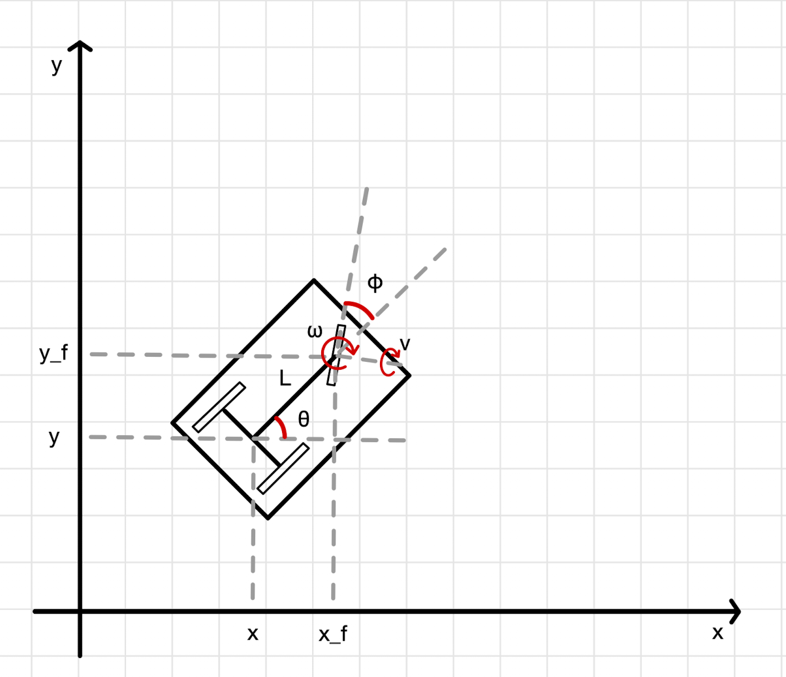<br>
  <em>Figure 1: The robot used for the calibration</em>
</p>

## Dataset
The dataset.txt file contains sensor data of a real robot:
- the first lines include information about the robot's kinematic model, the parameters to be estimate, intial guess, encoder field order and maximum ranges.
- each record cosists of:
    - the time stamp
    - steering encoder reading
    - traction encoder reading
    - odometry data
    - sensor position

## Encoder data
Encoder readings are stored as **uint32** values. To avoid overflow issues, we consider only the incremental changes between ticks when integrating the kinematic model.

## Input
- A file containing encoder ticks from all encoders: absolute ticks for the steering axis and incremental ticks for the traction wheel.
- The positions of the sensor w.r.t. an external tracking system.
- parameter values: Ksteer = 0.1, Ktraction = 0.0106141, axis_length = 1.4, steer_offset = 0 
- joints max encoder values: steering = 8192, traction_wheel = 5000 
- laser wrt base link has: translation = [1.5, 0, 0] and rotation = [0, 0, 0, 1]

## Methodology
Identify the state space X:
- Qualify the domain
- Find a locally Euclidean parameterization

Identify the measurement space(s) Z:
- Qualify the domain
- Find a locally Euclidean parameterization

Identify the prediction functions h(x)

## Robot trajectory

### Preprocessing
After loading the dataset, two functions are used to compute the required differentials:
- delta_ticks function: computes the variation between successive encoder ticks
- delta time function: computes the time difference between successive samples

### Odometry position estimation
To generate the odometry-based trajectory, the following must be considered:
- ksteer: how many radians correspond to one tick
- ktraction: how many meter correspond to one tick
- steer offset: at which angle correspond the zero of the wheel
- base line: the lenght of the base line, the kinematic center is in the middle of the axis of the rear wheels

The odometry function performs the following:
- converts tick readings into traction velocity v and steering angle change dphi
- inizializes the first pose as [0, 0, 0, 0]
- For subsequent samples, computes motion increments:
    - dth: orientation change
    - dphi: steering angle change
    - dx and dy: movement in x and y directions
- adds a small noise value = 0.00001 (this value was chosen after testing several options)
- skips increments smaller than predefined alpha thresholds (which were also selected through experimentation)

### Odometry trajectory
<p align="center">
  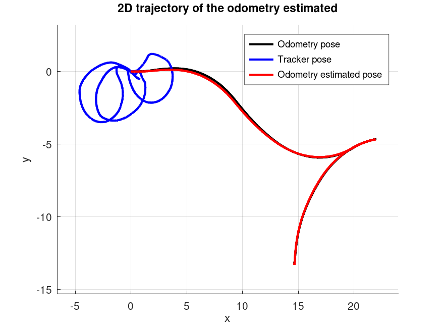
  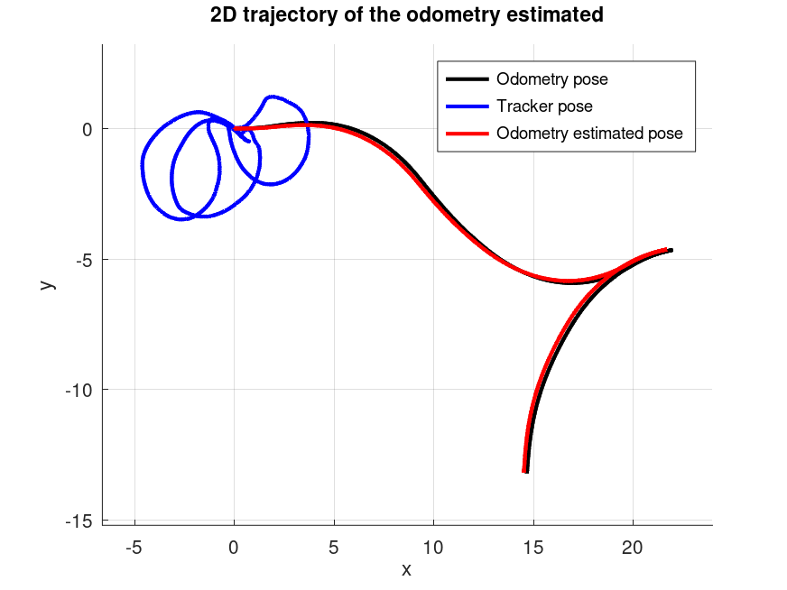
</p>
<p align="center">
  <em>Figure 2: Simplified model (left) and realistic model (right)</em>
</p>

The plots (Fig. 2) show that the estimated trajectory closely follows the ground truth of the odometry pose.

### L2 norm error of odometry estimated
<p align="center">
  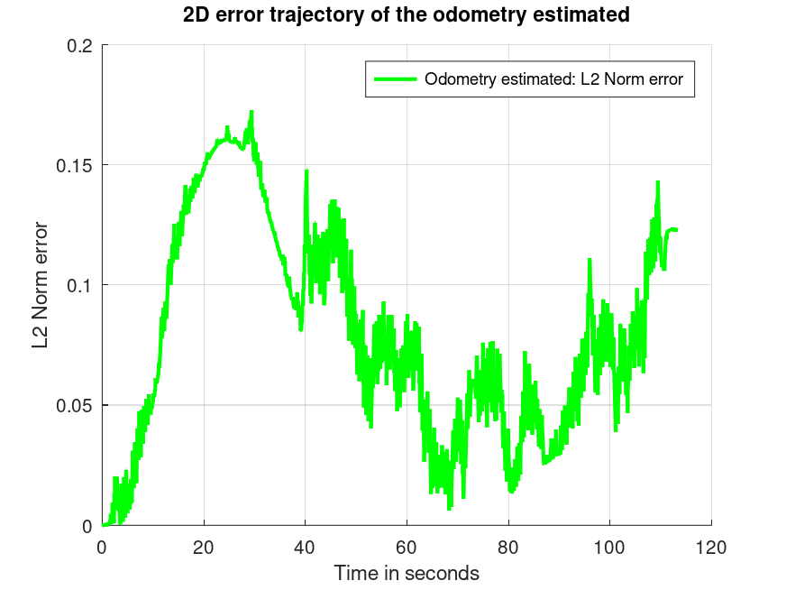
  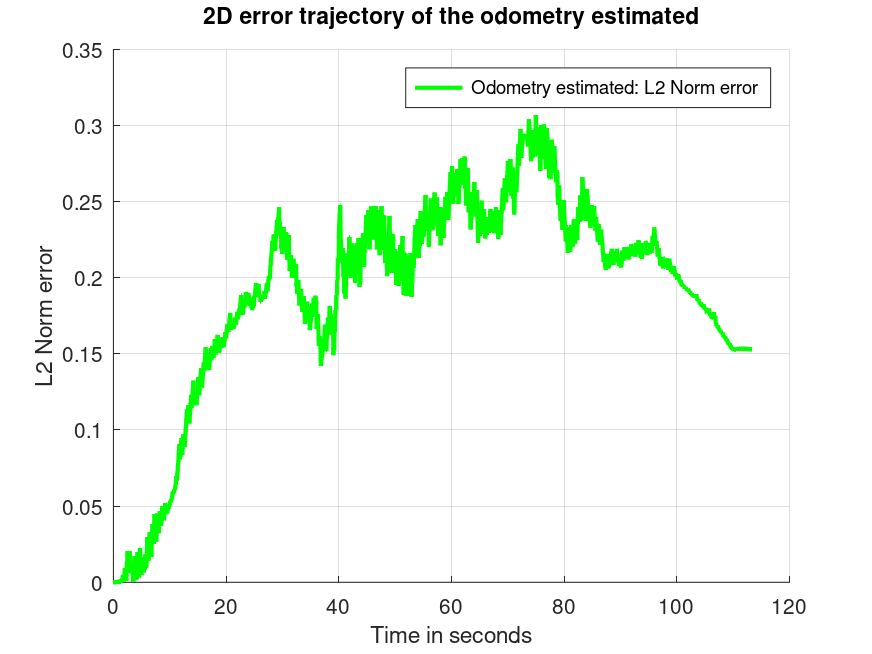
</p>
<p align="center">
  <em>Figure 3: Simplified model (left) and realistic model (right)</em>
</p>

The plots (Fig. 3) illustrate the L2 norm error over the trajectory. Two kinematic models were compared during the trajectory estimation:
- realistic model: $dx = v * cos(\theta) * cos(\phi) * \Delta t$ and $dy = v * sin(\theta) * cos(\phi) * \Delta t$
- simplified model: $dx = v * cos(\theta) * \Delta t$ and $dy = v * sin(\theta) * \Delta t$

For $d\theta$ and $d\phi$ the same equations were used:
- $d\theta = v * (sin(d\phi) / l) * \Delta t$, where $l$ is the axis length
- $d\phi = d\phi * \Delta t$

Surprisingly, the simplified model produced better performance. This is likely due to the fact that, in real-world conditions, the simplified model:
- is more robust to sensor noise and calibration errors
- requires less precision in the estimation of physical parameters
- avoids amplifying small errors from the steering angle in the translational motion

L2 norm error:
- realistic model: mean 0.190549, min 0.000000 and max 0.306568.
- simplified model : mean 0.079684, min 0.000000 and max 0.172628

Therefore, based on the results, the **simplified model** is the better choice and is used for the implementation.

### Threshold for estimation process
Different thresholds are applied to $x$, $y$, $\theta$, and $\phi$ during the estimation process to skip increments that are too small to provide meaningful information. These thresholds were tuned by testing various values and selecting those that yielded the best results in terms of L2 norm error:
- L2 norm error with thresholds: mean 0.079684, min 0.000000 and max 0.172628.
- L2 norm error without thresholds: mean 0.213036, min 0.000000 and max 0.496266.

## Robot calibration
The calibration of a mobile robot’s odometry aims to systematically correct scale errors, angular inaccuracies, offsets in the kinematic model, and the transformation between the sensor and the robot base. This is achieved by comparing odometry data, based on encoders and kinematic models, with ground truth data provided by a tracking system.

### Preprocessing
From the odometry data, only the values $x$, $y$ and $\theta$ are used. (since the ground truth provides these three components).

### Calibration
The calibration algorithhm uses an iterative **Lenberg-Marquardt** optimization, combining **gradient descent** and the **Gauss-Newton method**.

This approach estimates both:
- the correction matrix X, which compensates for systematic odometric distortions
- the trasformation of the laser with respect to the robot frame.

The initial state vector is composed of:
- the nine elements of the identity matrix, representing the initial guess for X
- the initial guess of the laser trasformation $x$, $y$, and $\theta$

The optimization is based on minimizing the error between the incremental poses obtained from odometry and the tracking system, also considering the laser transformation.
Convergence is controlled by:
- the update step norm $||\Delta x||$
- the variation in the chi-square value between successive iterations
- a counter for consecutive rejected steps.

To avoid numerical instability a damping factor is introduced (computed from the largest diagonal element of the Hessian matrix).

The odometry calibration returns several outputs:
- a correction matrix X (3x3)
- the estimated laser pose with respect to the robot base
- chi-square error statistics for each iteration
- the number of inliers used in the optimization.

It is also possible to choose the number of iterations and whether to use an analytical or numerical Jacobian.

**Chi-square error statistics**
<p align="center">
  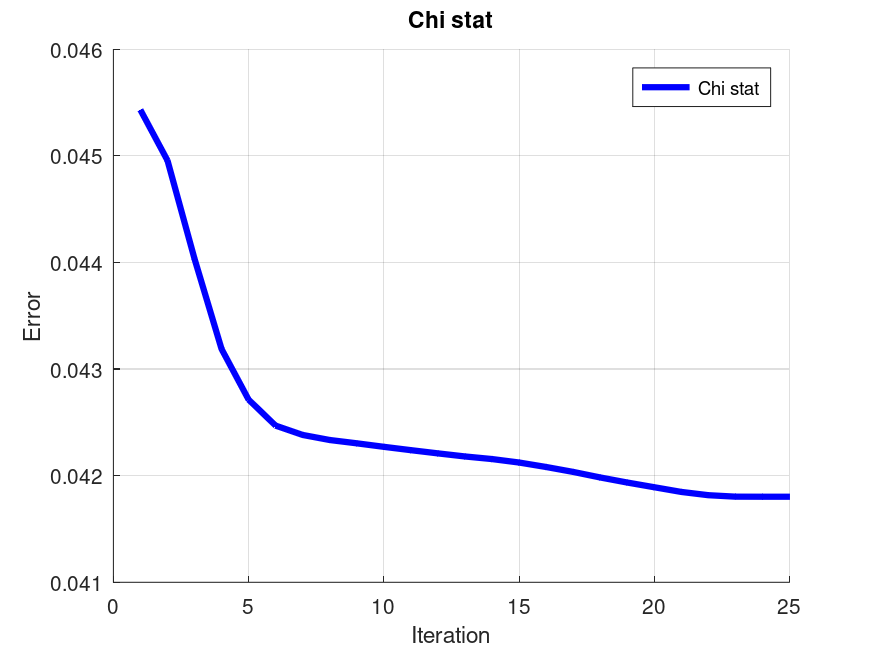
  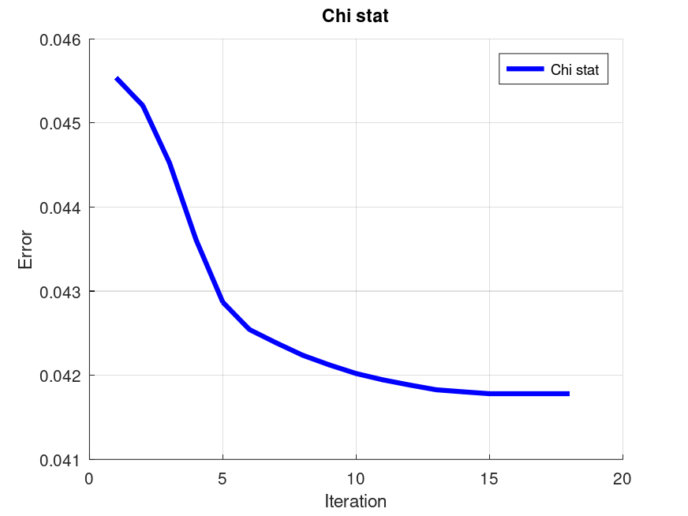
</p>
<p align="center">
  <em>Figure 4: Numerical jacobian (left) and analytical jacobian (right)</em>
</p>

### Odometry correction
Once the correction matrix X is estimated, the corrected odometry trajectory is computed. The odometry\_correction function applies X to the odometry increments, correcting systematic distortions and reconstructing the trajectory step by step. Afterward, the function to\_tracker\_frame converts the corrected trajectory from the robot frame to the tracker frame, using the estimated laser transformation.

In summary, raw odometry data are corrected using both:
- the correction matrix X
- the transformation of the laser with respect to the base.

The mean error between the odometry and the tracking data is computed both before and after calibration.

The generated plots show the effect of the calibration:
- corrected odometry vs. ground truth
- corrected vs. true orientation

**Numerical jacobian**
<p align="center">
  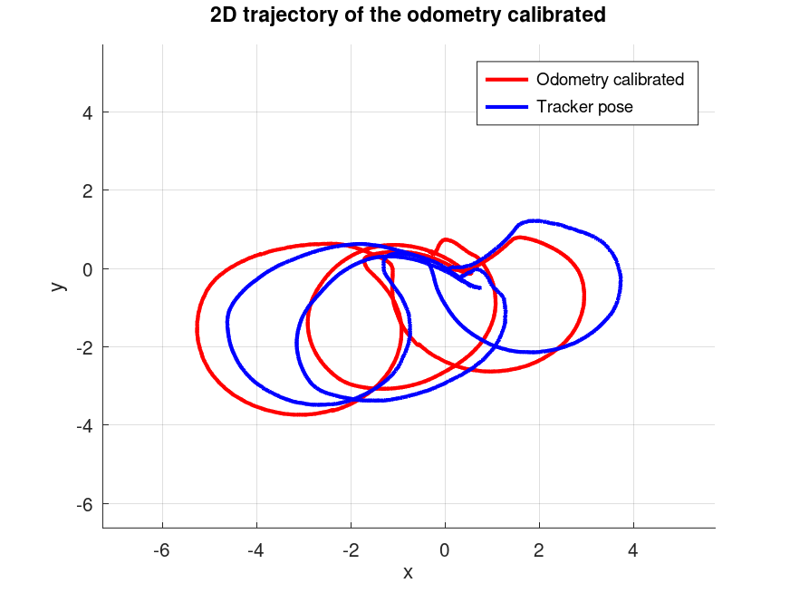
  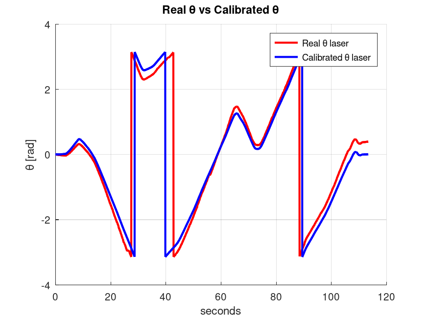
</p>
<p align="center">
  <em>Figure 5: Calibrated odometry vs. ground truth (left) and calibrated orientation comparison (right)</em>
</p>

**Analytical jacobian**
<p align="center">
  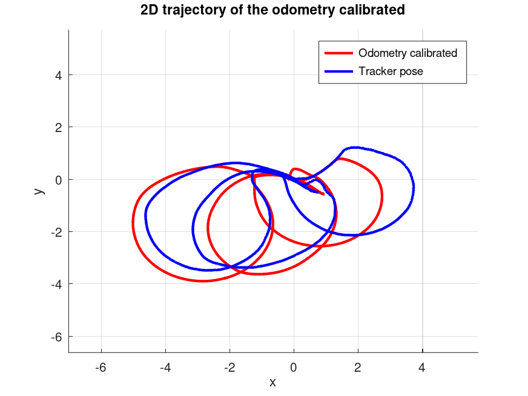
  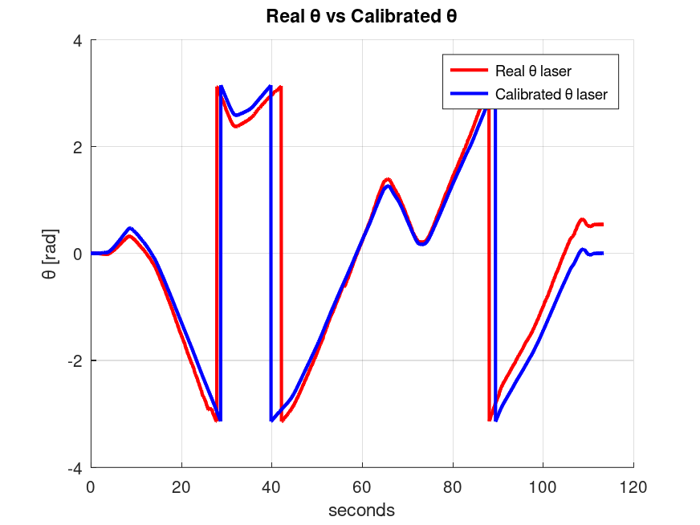
</p>
<p align="center">
  <em>Figure 6: Calibrated odometry vs. ground truth (left) and calibrated orientation comparison (right)</em>
</p>

Additionally, the L2 error over time is plotted:
<p align="center">
  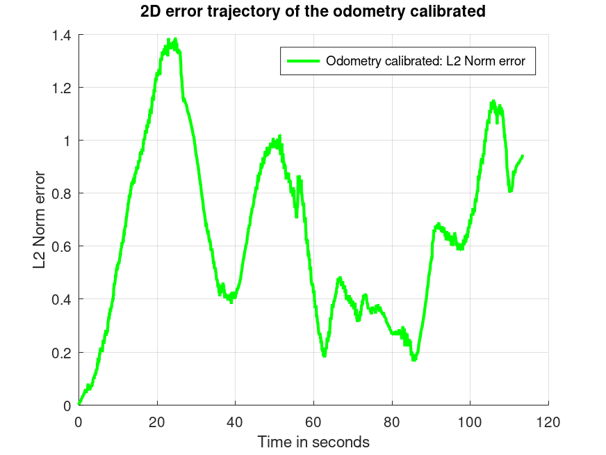
  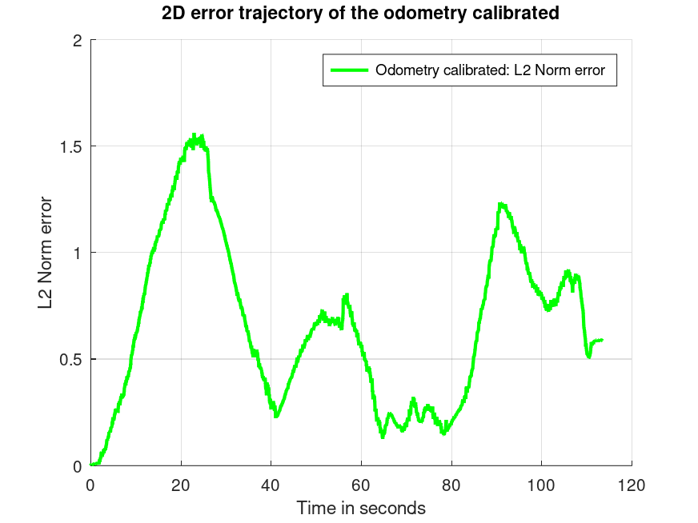
</p>
<p align="center">
  <em>Figure 7: Numerical jacobian (left) and analytical jacobian (right)</em>
</p>

### Analysis of calibrated parameters
The initial kinematic parameters (ksteer, ktraction, steer offset and baseline) are updated based on the estimated correction matrix X.

Each parameter is rescaled by the corresponding coefficient from X, allowing the calibrated model to better reflect the true motion behavior of the robot.

### Correction matrix X analysis
The correction matrix X compensates for systematic odometric errors:
- scaling factors in $x$, $y$ and $\theta$
- cross-couplig effects between $x$ and $y$ directions.

### Final verification
The effectiveness of the calibration is assessed by:
- the reduction of the final chi-square value
- the decrease in the mean error, L2 norm, between the corrected trajectory and the ground truth
- the number of inliers in each iteration

The chi-square value is a robust statistical metric for evaluating how well the model fits the observed data. A decrease in both chi-square and mean error indicates that the calibration effectively compensates for odometric distortions and improves the accuracy of the motion estimation.

## Output
- Estimated 2D position of the laser sensor with respect to the robot's base link (Initial values: x = 1.500, y = 0.000, theta = 1.000)
  - **Numerical jacobian**:
    - Calibrated values: x = -1.325, y = -0.261, theta = 1.000
  - **Analytical jacobian**:
    - Calibrated values: x = -1.280, y = -0.385, theta = 0.998

- Calibrated kinematic parameters: Ksteer, Ktraction, steer offset and baseline (Initial values: ksteer = 0.100000, ktraction = 0.010614, steer offset = 0.000000 and base line = 1.4000)
  - **Numerical jacobian**:
    - ksteer: 0.500306 rad/tick
    - ktraction: 1.690311 m/tick
    - steer offset: 0.000000 rad
    - base line: 1.4000 m
  - **Analytical jacobian**
    - ksteer: 0.490559 rad/tick
    - ktraction: 0.426997 m/tick
    - steer offset: 0.000000 rad
    - base line: 1.4000 m

### Other output
**Numerical jacobian**
Calibration results
Mean error before calibration: 14.5470 m
Mean error after calibration: 0.9284 m
Improvement: 13.6186 m (93.6%)
L2 Norm error: mean 0.646273, min 0.002720, max 1.385045.
2D position of the sensor w.r.t. the base link
x: -1.3252 m
y: -0.2613 m
theta: 0.9998 rad (57.28 degrees)

Analysis on correction matrix X
X:
   3.4138e-01   1.0498e+02   3.0392e+00
  -4.9854e-01  -1.5925e+02  -4.6778e-01
   1.5002e-02  -5.1442e+01   5.0031e+00

Scale factor x: 0.3414 (-65.9%)
Scale factor y: -159.2511 (-16025.1%)
Scale factor theta: 5.0031 (400.3%)
Cross-coupling xy: 104.980799
Cross-coupling yx: -0.498540

Calibration verification
Error improvement: 93.6%
Final Chi-square: 4.268839e-02

**Analytical jacobian**
Calibration results
Mean error before calibration: 14.5470 m
Mean error after calibration: 0.9225 m
Improvement: 13.6246 m (93.7%)
L2 Norm error: mean 0.662266, min 0.001601, max 1.559847.
2D position of the sensor w.r.t. the base link
x: -1.2803 m
y: -0.3847 m
theta: 0.9982 rad (57.19 degrees)

Analysis on correction matrix X
X:
   3.6021e-01   3.3140e+01   3.5827e+00
  -5.5232e-01  -4.0228e+01  -9.6537e-01
  -1.8905e-02  -8.7996e+00   4.9056e+00

Scale factor x: 0.3602 (-64.0%)
Scale factor y: -40.2276 (-4122.8%)
Scale factor theta: 4.9056 (390.6%)
Cross-coupling xy: 33.139730
Cross-coupling yx: -0.552323

Calibration verification
Error improvement: 93.7%
Final Chi-square: 4.266616e-02

The output results and images are in the folder: ``` ./output ```

## How run the code
```shell
octave main.m
```
to observer the robot and sensor trajectories moving set:
```shell
octave main.m on
```

### Project structure
```text
.
├── dataset.txt
├── images
│   └── robot.png
├── LICENSE
├── main.m
├── output
│   ├── chi_stat_analytical_jacobian.png
│   ├── chi_stat_numerical_jacobian.png
│   ├── error_odometry_calibrated_analytical_jacobian.png
│   ├── error_odometry_calibrated_numerical_jacobian.png
│   ├── error_odometry_estimated_realistic_model.png
│   ├── error_odometry_estimated_simplified_model.png
│   ├── odometry_calibrated_analytical_jacobian.png
│   ├── odometry_calibrated_numerical_jacobian.png
│   ├── odometry_estimated_realistic_model.png
│   ├── odometry_estimated_simplified_model.png
│   ├── output_analytical_jacobian.txt
│   ├── output_numerical_jacobian.txt
│   ├── theta_calibrated_analytical_jacobian.png
│   └── theta_calibrated_numerical_jacobian.png
├── README.md
└── robot_calibration
    ├── calibration.m
    ├── plots.m
    ├── trajectory.m
    └── utilities.m
```

## Author:
- Michael Corelli

## Reference
- https://gitlab.com/grisetti/probabilistic_robotics_2024_25
