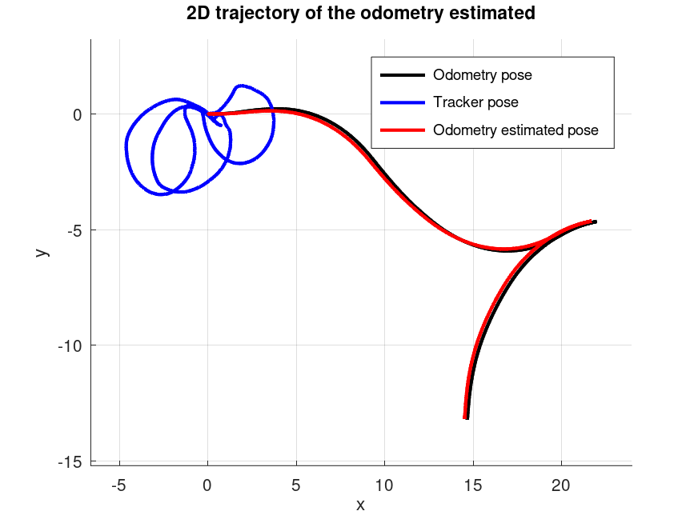
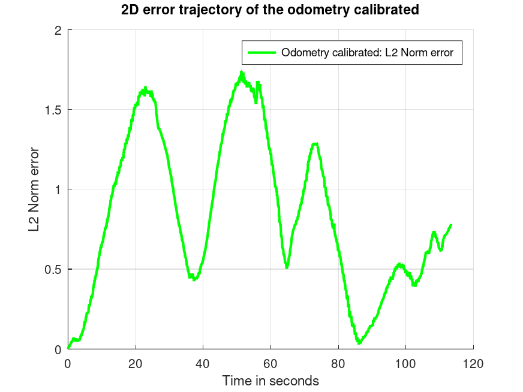

# Calibration of a (real) Robot
It is a Probabilistic Robotics project and consist in the calibration of: the kinematic parameters and the sensor positions of a front-rear tricycle-like robot.
The following information is required for calibration: 
- a dataset.txt file containing the data that come from the sensor of a real robot
- an intial guess of the kinematic parameters to be estimate
- the encoder field order and their maximum values to correctly interpret encoder tick data

## Definition of the problem
The problem involves:
- a front-rear tricycle-like robot
- encoder ticks readings
- sensor positions with respect to an external tracking system

In the following image we can observe the robot rappresentation:


## Dataset
The dataset.txt file contains sensor data of a real robot:
- the first lines include information about the robot's kinematic model, the parameters to be estimate, intial guess, encoder field order and maximum ranges.
- each record cosists of:
    - the time stamp
    - steering encoder reading
    - traction encoder reading
    - odometry data
    - sensor position

## Encoder data
Encoder readings are stored as **uint32** values. To avoid overflow issues, we consider only the incremental changes between ticks when integrating the kinematic model.

## Input
- A file containing encoder ticks from all encoders: absolute ticks for the steering axis and incremental ticks for the traction wheel.
- The positions of the sensor w.r.t. an external tracking system.
- parameter values: Ksteer = 0.1, Ktraction = 0.0106141, axis_length = 1.4, steer_offset = 0 
- joints max encoder values: steering = 8192, traction_wheel = 5000 
- laser wrt base link has: translation = [1.5, 0, 0] and rotation = [0, 0, 0, 1]

## Methodology
Identify the state space X:
- Qualify the domain
- Find a locally Euclidean parameterization

Identify the measurement space(s) Z:
- Qualify the domain
- Find a locally Euclidean parameterization

Identify the prediction functions h(x)

## Robot trajectory

### Preprocessing
After loading the dataset, two functions are used to compute the required differentials:
- delta_ticks function: computes the variation between successive encoder ticks
- delta time function: computes the time difference between successive samples

### Odometry position estimation
To generate the odometry-based trajectory, the following must be considered:
- ksteer: how many radians correspond to one tick
- ktraction: how many meter correspond to one tick
- steer offset: at which angle correspond the zero of the wheel
- base line: the lenght of the base line, the kinematic center is in the middle of the axis of the rear wheels

The odometry function performs the following:
- converts tick readings into traction velocity v and steering angle change dphi
- inizializes the first pose as [0, 0, 0, 0]
- For subsequent samples, computes motion increments:
    - dth: orientation change
    - dphi: steering angle change
    - dx and dy: movement in x and y directions
- adds a small noise value = 0.00001 (this value was chosen after testing several options)
- skips increments smaller than predefined alpha thresholds (which were also selected through experimentation)

### Threshold for estimation process
Different thresholds are applied to $x$, $y$, $\theta$, and $\phi$ during the estimation process to skip increments that are too small to provide meaningful information. These thresholds were tuned by testing various values and selecting those that yielded the best results in terms of L2 norm error:
- with thresholds: L2 norm error -> mean 0.079684, min 0.000000 and max 0.172628.
- without thresholds: L2 norm error -> mean 0.213036, min 0.000000 and max 0.496266.

### Odometry trajectory:

The plot shows that the estimated trajectory closely follows the ground truth of the odometry pose.

### L2 norm error of odometry estimated:

This plot illustrates the L2 norm error over the trajectory. Two kinematic models were compared during the trajectory estimation:
- realistic model: $dx = v * cos(\theta)*cos(\phi)*\Delta t$ and $dy = v * sin(\theta)*cos(\phi)*\Delta t$
- simplified model: $dx = v * cos(\theta) * \Delta t$ and $dy = v * sin(\theta) * \Delta t$

For $d\theta$ and $d\phi$ were used the same equations:
- $d\theta = v * (sin(d\phi)/axis\_length)*\Delta t$
- $d\phi = d\phi*\Delta t$

Surprisingly, the simplified model produced better performance. This is likely due to the fact that, in real-world conditions, the simplified model:
- is more robust to sensor noise and calibration errors
- requires less precision in the estimation of physical parameters
- avoids amplifying small errors from the steering angle in the translational motion

L2 norm error:
- realistic model (used in the implementation): mean 0.079684, min 0.000000 and max 0.172628
- simplified model: mean 0.190549, min 0.000000 and max 0.306568.

## Robot calibration

## Output
- estimated 2D position of the sensor w.r.t. the base link
- estimated kinematic parameters: Ksteer, Ktraction, steer offset and base line.

## How run the code
```shell
octave main.m
```
to observer the robot and sensor trajectories moving set:
```shell
octave main.m on
```

## Author:
- Michael Corelli

## Reference
- https://gitlab.com/grisetti/probabilistic_robotics_2024_25
