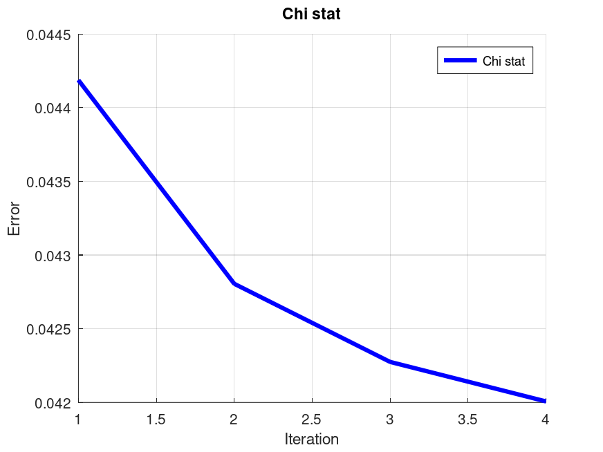
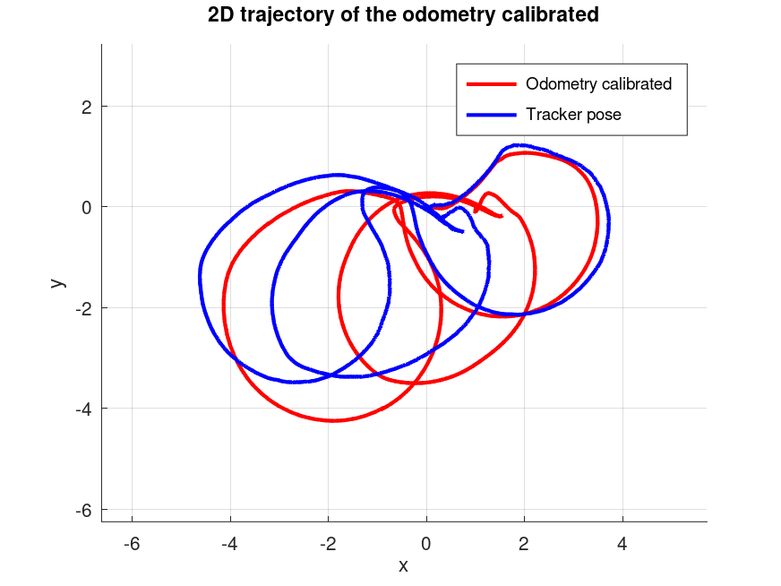

# Calibration of a (real) Robot
It is a Probabilistic Robotics project and consist in the calibration of: the kinematic parameters and the sensor positions of a front-rear tricycle-like robot.
The following information is required for calibration: 
- a dataset.txt file containing the data that come from the sensor of a real robot
- an intial guess of the kinematic parameters to be estimate
- the encoder field order and their maximum values to correctly interpret encoder tick data

## Definition of the problem
The problem involves:
- a front-rear tricycle-like robot
- encoder ticks readings
- sensor positions with respect to an external tracking system

In the following image we can observe the robot rappresentation:
<p align="center">
  <br>
  <em>Figure 1: The robot used for the calibration</em>
</p>

## Dataset
The dataset.txt file contains sensor data of a real robot:
- the first lines include information about the robot's kinematic model, the parameters to be estimate, intial guess, encoder field order and maximum ranges.
- each record cosists of:
    - the time stamp
    - steering encoder reading
    - traction encoder reading
    - odometry data
    - sensor position

## Encoder data
Encoder readings are stored as **uint32** values. To avoid overflow issues, we consider only the incremental changes between ticks when integrating the kinematic model.

## Input
- A file containing encoder ticks from all encoders: absolute ticks for the steering axis and incremental ticks for the traction wheel.
- The positions of the sensor w.r.t. an external tracking system.
- parameter values: Ksteer = 0.1, Ktraction = 0.0106141, axis_length = 1.4, steer_offset = 0 
- joints max encoder values: steering = 8192, traction_wheel = 5000 
- laser wrt base link has: translation = [1.5, 0, 0] and rotation = [0, 0, 0, 1]

## Robot trajectory

### Preprocessing
After loading the dataset, two functions are used to compute the required differentials:
- delta_ticks function: computes the variation between successive encoder ticks
- delta time function: computes the time difference between successive samples

### Odometry position estimation
To generate the odometry-based trajectory, the following must be considered:
- ksteer: how many radians correspond to one tick
- ktraction: how many meter correspond to one tick
- steer offset: at which angle correspond the zero of the wheel
- base line: the lenght of the base line, the kinematic center is in the middle of the axis of the rear wheels

The odometry function performs the following:
- converts tick readings into traction velocity v and steering angle change dphi
- inizializes the first pose as [0, 0, 0, 0]
- For subsequent samples, computes motion increments:
    - dth: orientation change
    - dphi: steering angle change
    - dx and dy: movement in x and y directions
- adds a small noise value = 0.00001 (this value was chosen after testing several options)
- skips increments smaller than predefined alpha thresholds (which were also selected through experimentation)

### Odometry trajectory
<p align="center">
  
  
</p>
<p align="center">
  <em>Figure 2: Simplified model (left) and realistic model (right)</em>
</p>

The plots (Fig. 2) show that the estimated trajectory closely follows the ground truth of the odometry pose.

### L2 norm error of odometry estimated
<p align="center">
  
  
</p>
<p align="center">
  <em>Figure 3: Simplified model (left) and realistic model (right)</em>
</p>

The plots (Fig. 3) illustrate the L2 norm error over the trajectory. Two kinematic models were compared during the trajectory estimation:
- realistic model: $dx = v * cos(\theta) * cos(\phi) * \Delta t$ and $dy = v * sin(\theta) * cos(\phi) * \Delta t$
- simplified model: $dx = v * cos(\theta) * \Delta t$ and $dy = v * sin(\theta) * \Delta t$

For $d\theta$ and $d\phi$ the same equations were used:
- $d\theta = v * (sin(d\phi) / l) * \Delta t$, where $l$ is the axis length
- $d\phi = d\phi * \Delta t$

Surprisingly, the simplified model produced better performance. This is likely due to the fact that, in real-world conditions, the simplified model:
- is more robust to sensor noise and calibration errors
- requires less precision in the estimation of physical parameters
- avoids amplifying small errors from the steering angle in the translational motion

L2 norm error:
- realistic model: mean 0.190549, min 0.000000 and max 0.306568.
- simplified model : mean 0.079684, min 0.000000 and max 0.172628

Therefore, based on the results, the **simplified model** is the better choice and is used for the implementation.

### Threshold for estimation process
Different thresholds are applied to $x$, $y$, $\theta$, and $\phi$ during the estimation process to skip increments that are too small to provide meaningful information. These thresholds were tuned by testing various values and selecting those that yielded the best results in terms of L2 norm error:
- L2 norm error with thresholds: mean 0.079684, min 0.000000 and max 0.172628.
- L2 norm error without thresholds: mean 0.213036, min 0.000000 and max 0.496266.

## Robot calibration
The calibration of a mobile robot’s odometry aims to systematically correct scale errors, angular inaccuracies, offsets in the kinematic model, and the transformation between the sensor and the robot base. This is achieved by comparing odometry data, based on encoders and kinematic models, with ground truth data provided by a tracking system.

### Preprocessing
From the odometry data, only the values $x$, $y$ and $\theta$ are used. (since the ground truth provides these three components).

### Calibration
The calibration algorithhm uses an iterative **Lenberg-Marquardt** optimization, combining **gradient descent** and the **Gauss-Newton method**.

This approach estimates both:
- the correction matrix X, which compensates for systematic odometric distortions
- the kinematic parameters
- the trasformation of the laser with respect to the robot frame.

The initial state vector is composed of:
- a 3x3 matrix X, initialized as the product of a rotation matrix (modeling the initial guess of the steering offset) and a diagonal scaling matrix (containing a good guess for traction, steering and angular gain)
- the initial axis lenght of the robot
- the initial guess of the laser trasformation $x$, $y$, and $\theta$

This provides a more informed starting point than using an identity matrix.

The optimization is based on minimizing the error between the incremental poses obtained from odometry and the tracking system, also considering the laser transformation.
Convergence is controlled by:
- the update step norm $||\Delta x||$
- the variation in the chi-square value between successive iterations
- a counter for consecutive rejected steps.

To avoid numerical instability a damping factor is introduced (computed from the largest diagonal element of the Hessian matrix).

The odometry calibration provides:
- a correction matrix X (3x3)
- the calibrated values of the kinematic parameters
- the estimated laser pose with respect to the robot base
- chi-square error statistics for each iteration
- the number of inliers used in the optimization.

It is also possible to choose the number of iterations and whether to use an analytical or numerical Jacobian.

**Chi-square error statistics**

Simplified model:
<p align="center">
  
  
</p>
<p align="center">
  <em>Figure 4: Numerical jacobian (left) and analytical jacobian (right)</em>
</p>

Realistic model:
<p align="center">
  
  
</p>
<p align="center">
  <em>Figure 4: Numerical jacobian (left) and analytical jacobian (right)</em>
</p>

### Odometry correction
Once the correction matrix X is estimated, the corrected odometry trajectory is computed. The odometry\_correction function applies X to the odometry increments, correcting systematic distortions and reconstructing the trajectory step by step. Afterward, the function to\_tracker\_frame converts the corrected trajectory from the robot frame to the tracker frame, using the estimated laser transformation.

In summary, raw odometry data are corrected using both:
- a good guess of kinematic paramters
- the transformation of the laser with respect to the base.

The mean error between the odometry and the tracking data is computed both before and after calibration.

The generated plots show the effect of the calibration:

#### Simplified model
- corrected odometry vs. ground truth
- corrected vs. true orientation

**Numerical jacobian**
<p align="center">
  
  
</p>
<p align="center">
  <em>Figure 5: Calibrated odometry vs. ground truth (left) and calibrated orientation comparison (right)</em>
</p>

**Analytical jacobian**
<p align="center">
  
  
</p>
<p align="center">
  <em>Figure 6: Calibrated odometry vs. ground truth (left) and calibrated orientation comparison (right)</em>
</p>

**The L2 error over time**
<p align="center">
  
  
</p>
<p align="center">
  <em>Figure 7: Numerical jacobian (left) and analytical jacobian (right)</em>
</p>

#### Realistic model
- corrected odometry vs. ground truth
- corrected vs. true orientation

**Numerical jacobian**
<p align="center">
  
  
</p>
<p align="center">
  <em>Figure 5: Calibrated odometry vs. ground truth (left) and calibrated orientation comparison (right)</em>
</p>

**Analytical jacobian**
<p align="center">
  
  
</p>
<p align="center">
  <em>Figure 6: Calibrated odometry vs. ground truth (left) and calibrated orientation comparison (right)</em>
</p>

**The L2 error over time**
<p align="center">
  
  
</p>
<p align="center">
  <em>Figure 7: Numerical jacobian (left) and analytical jacobian (right)</em>
</p>

### Analysis of calibrated parameters
The initial kinematic parameters (ksteer, ktraction, steer offset and baseline) are updated during the optimization process:
- the matrix X is decomposed into a rotation and scaling component to extract ksteer, ktraction and steer offset
- the axis length is included as an optimezed parameters

This calibration step ensures that the estimated parameters more accurately reflect the true kinematic behavior of the robot.

### Correction matrix X analysis
The correction matrix X compensates for systematic odometric errors:
- scaling factors in $x$, $y$ and $\theta$
- cross-couplig effects between $x$ and $y$ directions
- residual misalignments absorbed by the steer offset

### Final verification
The effectiveness of the calibration is assessed by:
- the reduction of the final chi-square value
- the decrease in the mean error, L2 norm, between the corrected trajectory and the ground truth
- the number of inliers in each iteration

The chi-square value is a robust statistical metric for evaluating how well the model fits the observed data. A decrease in both chi-square and mean error indicates that the calibration effectively compensates for odometric distortions and improves the accuracy of the motion estimation.

## Output
**Simplified model**
- Estimated 2D position of the laser sensor with respect to the robot's base link (Initial values: x = 1.500, y = 0.000, theta = 1.000)
  - **Numerical jacobian**:
    - Calibrated values: x = -1.325, y = -0.261, theta = 1.000
  - **Analytical jacobian**:
    - Calibrated values: x = -1.280, y = -0.385, theta = 0.998

- Calibrated kinematic parameters: Ksteer, Ktraction, steer offset and baseline (Initial values: ksteer = 0.100000, ktraction = 0.010614, steer offset = 0.000000 and base line = 1.4000)
  - **Numerical jacobian**:
    - ksteer: 0.209744 rad/tick
    - ktraction: 0.006303 m/tick
    - steer offset: -1.066783 rad
    - base line: 1.358440 m
  - **Analytical jacobian**
    - ksteer: 0.200239 rad/tick
    - ktraction: 0.007027 m/tick
    - steer offset: -0.977283 rad
    - base line: 1.375746 m

- Estimated 2D position of the laser sensor with respect to the robot's base link (Initial values: x = 1.500, y = 0.000, theta = 1.000)
  - **Numerical jacobian**:
    - Calibrated values: x = -0.5257, y = -0.2707, theta = 0.9999
  - **Analytical jacobian**:
    - Calibrated values: x = -1.3503, y = -0.5288, theta = 0.9997

**Realistic model**
- Calibrated kinematic parameters: Ksteer, Ktraction, steer offset and baseline (Initial values: ksteer = 0.100000, ktraction = 0.010614, steer offset = 0.000000 and base line = 1.4000)
  - **Numerical jacobian**:
    - ksteer: 0.196043 rad/tick
    - ktraction: 0.006376 m/tick
    - steer offset: -1.065996 rad
    - base line: 1.358168 m
  - **Analytical jacobian**
    - ksteer: 0.164106 rad/tick
    - ktraction: 0.007154 m/tick
    - steer offset: -0.976285 rad
    - base line: 1.374741 m

- Estimated 2D position of the laser sensor with respect to the robot's base link (Initial values: x = 1.500, y = 0.000, theta = 1.000)
  - **Numerical jacobian**:
    - Calibrated values: x = -0.5263, y = -0.2723, theta = 0.9999
  - **Analytical jacobian**:
    - Calibrated values: x = -1.3515, y = -0.5411, theta = 0.9993

### Other output
**Numerical jacobian**

Calibration results of simplified model:
- Mean error before calibration: 14.5470 m
- Mean error after calibration: 1.4210 m
- Improvement: 13.1260 m (90.2%)

```text
Chi-square statistics:
   0.045166   0.043741   0.043205   0.042925
```

Calibrated parameters:
- ktraction (speed scale): 0.006303 (initial: 0.010614), change: -40.6%
- ksteer (steering scale): 0.209744 (initial: 0.100000), change: 109.7%
- steer_offset: -1.066783 rad = -61.12° (initial: 0.00°), change: -61.12°
- axis_length: 1.358440 m (initial: 1.400 m), change: -3.0%

Scale factor:
- Scale X: 0.593867 (-40.61% change)
- Scale Y: 2.097437 (109.74% change)
- Scale Theta: 4.961182 (396.12% change)

2D position of the sensor with respect to the base link:
- x: -0.5257 m
- y: -0.2707 m
- theta: 0.9999 rad (57.29 degrees)

Calibration validation:
- Error improvement: 90.2%
- Final chi-square: 4.292541e-02
- Initial chi-square: 4.516616e-02
- Chi-square reduction: 5.0%
- L2 Norm error: mean 1.017248, min 0.002762, max 2.292623.

Calibration results of realistic model:
- Mean error before calibration: 14.4164 m
- Mean error after calibration: 1.4169 m
- Improvement: 12.9995 m (90.2%)

```text
Chi-square statistics:
   0.045177   0.043734   0.043181   0.042902
```

Calibrated parameters:
- ktraction (speed scale): 0.006376 (initial: 0.010614), change: -39.9%
- ksteer (steering scale): 0.196043 (initial: 0.100000), change: 96.0%
- steer_offset: -1.065996 rad = -61.08° (initial: 0.00°), change: -61.08°
- axis_length: 1.358168 m (initial: 1.400 m), change: -3.0%

Scale factor:
- Scale X: 0.600681 (-39.93% change)
- Scale Y: 1.960429 (96.04% change)
- Scale Theta: 4.960237 (396.02% change)

2D position of the sensor with respect to the base link:
- x: -0.5263 m
- y: -0.2723 m
- theta: 0.9999 rad (57.29 degrees)

Calibration validation:
- Error improvement: 90.2%
- Final chi-square: 4.290178e-02
- Initial chi-square: 4.517725e-02
- Chi-square reduction: 5.0%
- L2 Norm error: mean 1.013364, min 0.002757, max 2.271333.

**Analytical jacobian**

Calibration results of simplifed model:
- Mean error before calibration: 14.5470 m
- Mean error after calibration: 0.8269 m
- Improvement: 13.7201 m (94.3%)

```text
Chi-square statistics:
 Columns 1 through 7:

   0.045697   0.044226   0.043651   0.043371   0.043208   0.043126   0.043077

 Columns 8 through 14:

   0.043046   0.042980   0.042936   0.042886   0.042846   0.042810   0.042798

 Columns 15 through 17:

   0.042794   0.042766   0.042746
```

Calibrated parameters:
- traction (speed scale): 0.007027 (initial: 0.010614), change: -33.8%
- ksteer (steering scale): 0.200239 (initial: 0.100000), change: 100.2%
- steer_offset: -0.977283 rad = -55.99° (initial: 0.00°), change: -55.99°
- axis_length: 1.375746 m (initial: 1.400 m), change: -1.7%

Scale factor:
- Scale X: 0.662025 (-33.80% change)
- Scale Y: 2.002387 (100.24% change)
- Scale Theta: 4.893099 (389.31% change)

2D position of the sensor with respect to the base link:
- x: -1.3503 m
- y: -0.5288 m
- theta: 0.9997 rad (57.28 degrees)

Calibration validation:
- Error improvement: 94.3%
- Final chi-square: 4.274564e-02
- Initial chi-square: 4.569650e-02
- Chi-square reduction: 6.5%
- L2 Norm error: mean 0.596068, min 0.000605, max 1.432876.

Calibration results of realistic model:
- Mean error before calibration: 14.4164 m
- Mean error after calibration: 0.8187 m
- Improvement: 13.5977 m (94.3%)

```text
Chi-square statistics:
 Columns 1 through 7:

   0.045706   0.044229   0.043644   0.043385   0.043205   0.043117   0.043077

 Columns 8 through 14:

   0.043021   0.042972   0.042905   0.042853   0.042824   0.042795   0.042791

 Columns 15 through 18:

   0.042784   0.042776   0.042771   0.042758
```

Calibrated parameters:
- ktraction (speed scale): 0.007154 (initial: 0.010614), change: -32.6%
- ksteer (steering scale): 0.164106 (initial: 0.100000), change: 64.1%
- steer_offset: -0.976285 rad = -55.94° (initial: 0.00°), change: -55.94°
- axis_length: 1.374741 m (initial: 1.400 m), change: -1.8%

Scale factor:
- Scale X: 0.674001 (-32.60% change)
- Scale Y: 1.641056 (64.11% change)
- Scale Theta: 4.841329 (384.13% change)

2D position of the sensor with respect to the base link:
- x: -1.3515 m
- y: -0.5411 m
- theta: 0.9993 rad (57.26 degrees)

Calibration validation:
- Error improvement: 94.3%
- Final chi-square: 4.275811e-02
- Initial chi-square: 4.570565e-02
- Chi-square reduction: 6.4%
- L2 Norm error: mean 0.639362, min 0.000965, max 1.384192.

The output results and images are in the folder: ``` ./output ```

## Analysis of the output
Both calibration methods (numerical and analytical Jacobian) reach very similar results in terms of final error and overall improvement, as confirmed by the chi-square and L2 norm errors.

## Tried subsample
When dealing with a large amount of noisy data, it is possible to reduce the noise by subsampling the dataset. Different subsampling rates were tested, but in every case, the performance was worse compared to using the full dataset. The following is an example using the best model from this study, with one sample kept every 20 data points:

<p align="center">
  
  
</p>
<p align="center">
  <em>Figure 6: Calibrated odometry vs. ground truth (left) and calibrated orientation comparison (right)</em>
</p>

<p align="center">
  
</p>
<p align="center">
  <em>Figure 4: Chi-sqaure with subsample</em>
</p>

<p align="center">
  
  
</p>
<p align="center">
  <em>Figure 6: Calibrated odometry vs. ground truth (left) and calibrated orientation comparison (right)</em>
</p>

<p align="center">
  
</p>
<p align="center">
  <em>Figure 7: L2 norm error with data subsample</em>
</p>

**Models** utilized:
- Simplified model: models only the key components of the system, using fewer parameters. It is more computationally efficient.
- Realisitc mdoel: more detailed and accurate representations of the robot’s physical behavior, offering greater model fidelity at the cost of increased computational complexity.

**Numerical stability**
- Analytical jacobian:
  - converges in fewer iterations
  - produces parameter that are more consistent with the physical behavior of the robot
  - achieves better final errors
  - provides more consistent and stable sensor position estimates
- Numerical jacobian:
  - requires more iterations to converge
  - shows larger oscillations in the estimated parameters

## Conclusions
The analytical jacobian provides the best performance:
- faster and more stable convergence
- more realistic and physically consistent parameter estimates
- lower final errors and better calibration accuracy

The simpified model performs comparably to the realisitc model, but:
- is more computationally efficient
- achieves nearly identical improvements in final error
- is preferable when computational resources are limited

The trajectory reconstruction using the simplified model shows excellent accuracy, with an L2 norm error of mean 0.079684, min 0.000000 and max 0.172628.

The best result is obtained using the simplified model with the analytical Jacobian, which offers the best trade-off between accuracy, stability and computational efficiency.
- mean final error 0.8269 m
- error reductiuon 94.3%
- estimated paramters: physically plausible and consistent

## How run the code
```shell
octave main.m
```
to observer the robot and sensor trajectories moving set:
```shell
octave main.m on
```

### Project structure
```text
.
├── dataset.txt
├── images
│   └── robot.png
├── LICENSE
├── main.m
├── output
│   ├── chi_stat_realistic_model_analytical_jacobian.png
│   ├── chi_stat_realistic_model_numerical_jacobian.png
│   ├── chi_stat_simplified_model_analytical_jacobian_subsample.png
│   ├── chi_stat_simplified_model_analytical_jacobian.png
│   ├── chi_stat_simplified_model_numerical_jacobian.png
│   ├── error_odometry_calibrated_realistic_model_analytical_jacobian.png
│   ├── error_odometry_calibrated_realistic_model_numerical_jacobian.png
│   ├── error_odometry_calibrated_simplified_model_analytical_jacobian_subsample.png
│   ├── error_odometry_calibrated_simplified_model_analytical_jacobian.png
│   ├── error_odometry_calibrated_simplified_model_numerical_jacobian.png
│   ├── error_odometry_estimated_realistic_model.png
│   ├── error_odometry_estimated_simplified_model_analytical_jacobian_subsample.png
│   ├── error_odometry_estimated_simplified_model.png
│   ├── odometry_calibrated_realistic_model_analytical_jacobian.png
│   ├── odometry_calibrated_realistic_model_numerical_jacobian.png
│   ├── odometry_calibrated_simplified_model_analytical_jacobian_subsample.png
│   ├── odometry_calibrated_simplified_model_analytical_jacobian.png
│   ├── odometry_calibrated_simplified_model_numerical_jacobian.png
│   ├── odometry_estimated_realistic_model.png
│   ├── odometry_estimated_simplified_model_analytical_jacobian_subsample.png
│   ├── odometry_estimated_simplified_model.png
│   ├── output_realistic_model_analytical_jacobian.txt
│   ├── output_realistic_model_numerical_jacobian.txt
│   ├── output_simplified_model_analytical_jacobian_subsample.txt
│   ├── output_simplified_model_analytical_jacobian.txt
│   ├── output_simplified_model_numerical_jacobian.txt
│   ├── theta_calibrated_realistic_model_analytical_jacobian.png
│   ├── theta_calibrated_realistic_model_numerical_jacobian.png
│   ├── theta_calibrated_simplified_model_analytical_jacobian_subsample.png
│   ├── theta_calibrated_simplified_model_analytical_jacobian.png
│   └── theta_calibrated_simplified_model_numerical_jacobian.png
├── README.md
└── robot_calibration
    ├── calibration.m
    ├── plots.m
    ├── trajectory.m
    └── utilities.m
```

## Author:
- Michael Corelli

## Reference
- https://gitlab.com/grisetti/probabilistic_robotics_2024_25
